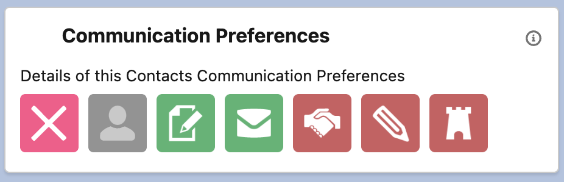

# Contact Bundle - Communication Preferences Extended

## Description
> An extended version of the Contact Communication Preferences, useful for a Nonprofit org. 

## Image
{: width="500"}

## Fields

| Fields | Value 
|-----------|-----------|
|Label|`Contact Communication Preferences`
|Indicator Bundle Name|`Contact_Communication_Preferences`
|Active|`true`
|sObject|`Contact`
|Card Title|`Communication Preferences`
|Card Icon|`standard:contact`
|Card Text|`Details of this Contact's Communication Preferences`
|Description|`Helpful to show the contact preferences of a Donor contact`

## Indicator Items

1. [Do Not Contact](../contact/contact-do-not-contact)
1. [Decesaed](../contact/contact-deceased.md)
1. [Mail Marketing](../contact/contact-mail-marketing.md)
1. [Email Marketing](../contact/contact-email-marketing)
1. [Thanking Requested](../contact/contact-thanking-requested.md)
1. [Postcards Reuqested](../contact/contact-no-postcards-requested.md)
1. [Legacy Mailing](../contact/contact-legacy-mailing.md)

## Contributed By
Emma Keeling, [Salesforce_Em](https://github.com/Salesforce-Em)

