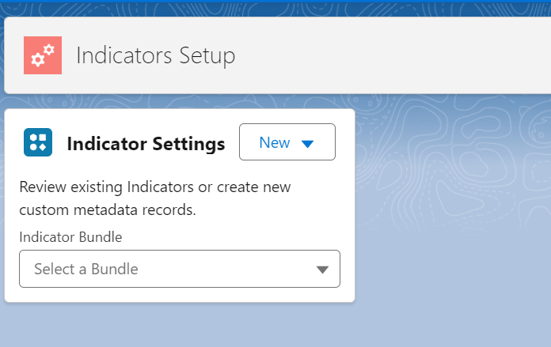

See [Indicator Bundle](../indicator-bundle) to set up the **Indicator Bundle** before setting up **Indicator Items**.

## Add a new Indicator Item
* Go to the *Indicators Setup* Tab

{: width="590"}

💡 If you don't see the *Indicator Setup* Tab, then ensure you have granted your user the correct [Permissions](../install-salesforce-indicators).

* Open the *Indicators Setup Menu*

{: width="590"}

* Use the *New* button to add a new **Indicator Item**

## Edit an existing Indicator Itrem

* Go to the *Indicator Settings* Tab
  * Choose the Indicator Bundle that the Indicator Item is on (or the Item will be in *Unbundled Items* if the Item is not on a Bundle yet). 
  * Click the *Edit Indicator* button

OR, alternatively:

* Edit the Settings in CMDT:
  * Navigate to Salesforce *Setup* > *Custom Metadata Types*
  * Scroll to *Indicator Items*, and click *Manage Records*
  * Click *Edit* next to the Item you want to edit

## Indicator Item Fields

|Field|Example Value|Description|Tip|
|---------|----------|-------------------|--------------------------|
|Label|`Contact Mobile`|Give it a descriptive name|Include the Object Name
|Indicator Item Name|`Contact_Mobile`|The API name
|sObject|`Contact`|Choose the Object whose values this Indicator references
|Field|`Mobile Phone`|Choose the Field whose values this indicator references
|Advanced Field||To use a field from a record higher in the parent-child relationship, directly enter the spanning fields (up to 5 level away). Example:  `Contact.Account.Owner.FirstName`
|Active|`true`||Leave this unchecked until the Indicator is ready to be added to a Bundle
|Description|`If the Contact's Mobile is Entered the icon will show`||Write something useful here, your future self will thank you
|Show when False or Blank|`false`|Should this indicator display anything when the field is false or blank?
|Hover Text|`The Contact has a Mobile Phone No. entered`|Text to display when the user hovers over the icon|Leaving the Hover Text blank will show the field value as the hover text
|Inverse Hover Text||The hover text when the indicator is false or blank
|Static Text||Text to display instead of a field value, icon, or image URL (only the first 3 characters or emojis will display)|Copy and paste [Emojis](https://emojipedia.org) here for some fun Indicators
|Inverse Static Text||The static text to use when false or blank
|Empty Static Text Behavior||Choose an option to use in place of static text, when indicator is false or blank|Default is `Use Icon Only` which will show the Icon if there is no Static Text entered. This field controls both regular and Inverse selections. Note: When using an Image this field is not used
|Icon Value|`custom:custom28`|The Lightning Design System icon when being used instead of Field, Text, or Image URL. Get Icons from from https://lightningdesignsystem.com/icons/{:target="_blank"}. Enter the full category and icon name like `custom:custom32`|If Static text is entered, the Icon color will be used, with the static text in white
|Inverse Icon Value||The Lightning Design System icon when being used instead of Field, Text, or Image URL for false or blank values
|Image||The URL to the image of the Indicator when being used instead of Field, Text, or Icon|eg link to a Static Resource, File, or Document in your Org|The use of an Image overrides any Icon settings
|Inverse Image||The URL to the image of the Indicator when being used instead of Field, Text, or Icon for false or blank values
|Zero Value Handling||How to treat Zeros (as blank or number)|Use in conjunction with Show when False or Blank

**💡Setup Tips**

* See the Examples and Recipes in this documentation for ideas on how to use these settings
* Zero Value Handling with the setting of `Treat Zeros as Blanks` works great for DLRS or NPSP Rollup fields where the field value will always be 0 or more. eg Count of Open Opportunities for an Account used in an Indicator to show that the Account has Open Opportunities. 
* When using [Extensions](../item-extension) the Configuration section can be left blank

**💡Design Tips**

* Don't use Icons that are in use in your Salesforce org elsewhere. Eg if you have Field Service installed, then don't use the `standard:service_crew` or `standard:service_crew_member` on Contact, as that will be confusing.
* Don't be too literal - just pick an icon that looks good, or use a few characters instead of the Icon. Your users will get used to which icons mean what, and they have the hover text to help them know what the icon means.
* Don't get too colorful - you can really make a mess. But use specific brand icons or colors for different brands in your company for example.
* See [Icon Tips](icon-tips) for more Icon ideas and tips.
* See [Fields and Formulas Tips](fields-tips) for tips on creating new Fields to use in your Indicators.
* See [Icon Colors](icon-colors) for tips on creating colorful icons.

## Rules
 🛠 _This section needs to be expanded upon._

* The indicators work with Boolean or Text fields. 
  * Date Fields can be used if you enter *Static Text* as the value that is shown does not make much sense. 
  * Number fields can be used as the value on the Indicator, if the number is not too big, or you use *Static Text*. 
* If the field is a Boolean and the value is False the Indicator will not show unless *Show When False or Blank* is checked an an *Inverse Icon Value* is entered for that Indicator.
* If the field is a Boolean and there is a value in *Static Text* then that text will show. Limit this text to 3 characters max, and Uppercase. 
* If the field is a Boolean and there is no value in *Static Text* the Icon will be shown.
* If the field is a Text field and there is no value in *Static Text* the first 3 characters of the field value will show, in Uppercase.
* If there is *Static Text*, the Icon image will not be shown, but the colour will be from the **Icon Value** entered. 
* If there is a value in *Image* that image will show. Use *Inverse Image* to show Images for False values.
  * *Image* will take precedence over *Icon Value*
* There is no field validation to ensure you don't use a combination of entries that look weird, so if it looks strange, just go back to simple Boolean or text fields.

## Known Issues

* SLDS Action Icons eg `action:check` do not render in the Indicator Component correctly. Action Icons are not designed for usage in Salesforce Avatar which is what the Indicators are based on. 

## Next Steps
* Add Optional [Extensions](../item-extension)
* Add the Indicator to a Bundle using [Indicator Bundle Items](../indicator-bundle-item)
