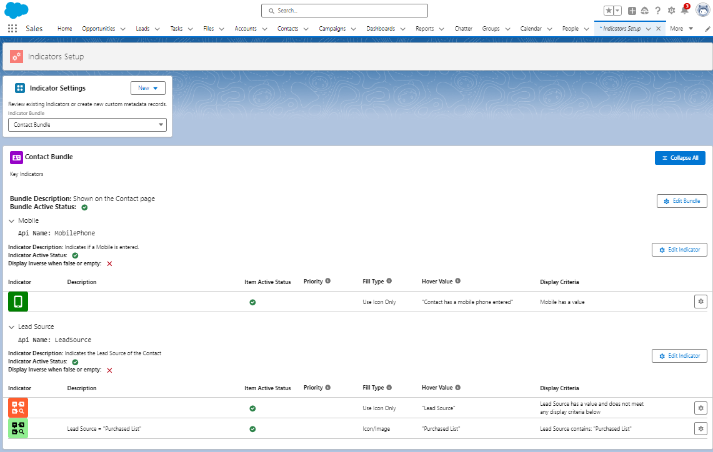

## Overview of the Key

The Key is a multi purpose component that has three main uses: 
* As a key to the Indicators that have been set up and are active on the page. Users can click the i icon to show the Key to get more information on why an Indicator is showing, or not showing. 
* As a quick link to the Indicator Setup for Admins. If you have the Indicator Setup Permission Set, then The Key is expanded to show setup icons. Clicking the Setup icons will take you directly to the CMDT record to modify the Bundle or Item. 
* As an overall setup page. If you have the Indicator Setup Permission Set, then the Indicators Tab is available and All Indicators will be visible from that tab, with direct links to create and edit the CMDT. 

{: .info-title}
>In Progress
>
>This needs to be built out further to describe how to modify the key details to provide the best user experience

### An Example Screen
_This example show a Bundle with two Indicator Items. The first is a simple item. The second is an item with one extension._

